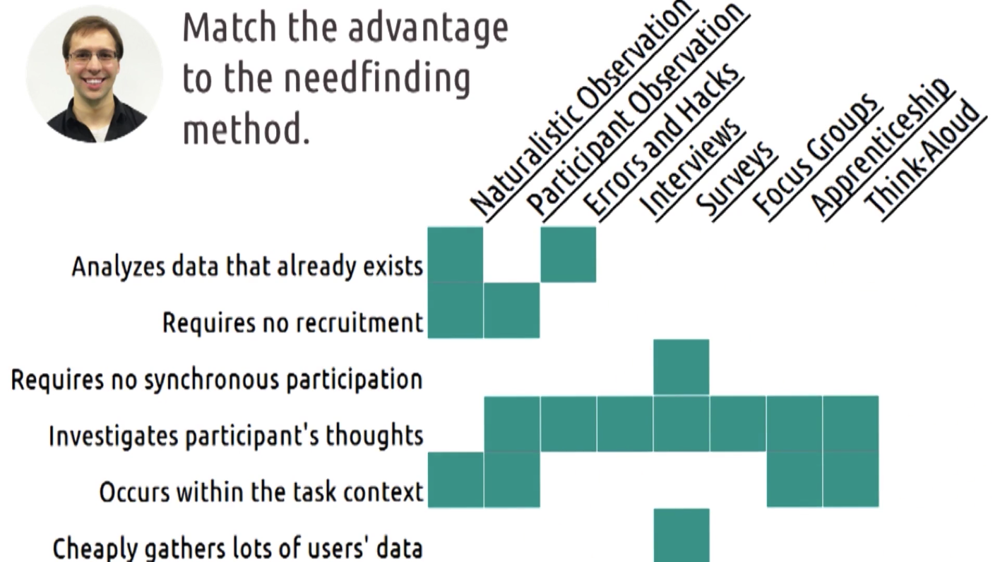

**EXAM #1 NOTES**

---

**1.1 Introduction to HCI**

*   Human-computer interaction can take different forms:
    *   Human interacts with computer (and vice-versa)
    *   Human interacts with a task through a computer (computer mediates the interaction) => the human + computer interact with the task together
        *   Ideally, we focus on making the interface of the computer/program as invisible as possible, so the human can focus on the task they’re trying to accomplish
        *   The goal is to let the user spend as much time thinking about the task rather than thinking about the interface
    *   Video games: the controller behaves as you expect it to, becoming invisible as you try to accomplish your in-game mission
    *   Having more than one remote control: you need to spend time looking at the remote, determining which one is best for the task, if you need to use multiple controls, etc
*   HCI is ubiquitous - it’s everywhere!
    *   We might be experts at interacting with computers, but that doesn’t make us experts at designing interactions between other humans and computers.
*   HCI is a subset of the broader field of **human factors engineering **
    *   **Human factors engineering**: designing the interactions between people and products, systems, or devices
        *   We’re interested in designing the interactions between people and computers, but computers are themselves products or systems.
        *   Human factors is interested in the non-computing parts of this as well
        *   As computers integrate themselves into more and more of our devices, the gap between human-computer interaction and human factors engineering is shrinking.
        *   Can be seen as the merging of engineering + psychology + design + cognitive science fields
        *   Psychology is a symbiotic field with HCI — psychology informs HCI, and we use our experiences and feedback in HCI to add to the field of psychology
    *   HCI is largely about understanding the interactions between humans and computers.
    *   UX design is largely about designing, or dictating, those interactions.
        *   We use what we understand about humans to design user experiences, then we use the results of these user experiences to examine whether our understanding was correct.
        *   Called **design-based research**: using the results of our designs to conduct research => research informs the design, and feedback from the designs informs/updates/adds to our research 

---

**1.2 Introduction to HCI**

*   **This class will be about**:
    *   HCI principles: fundamental design principles of HCI
    *   HCI methods: understanding the design life cycle + the role of iteration
    *   Performing user research
    *   Relationship between design principles and user research
    *   HCI applications: how these principles work in other technologies, domains, and ideas
*   **Design**: activity where you apply known principles to a new problem
    *   It’s also: an iterative process of need-finding, prototyping, evaluating, and revising [process where you gather information, use it to develop design alternatives, evaluate them with users, and revise them accordingly]
    *   You don’t want to ignore decades of experience when designing new interfaces, but simply applying known principles to a new problem doesn’t guarantee you have a good design
    *   Effectiveness goals
        *   Usability
        *   Research
        *   Change
    *   We want to **_design effective interactions between humans and computers_** — “WE DESIGN INTERACTIONS, not interfaces”
    *   "You are not your own user!” — focusing too much on your own experiences can give you a false sense of expertise

---

**1.3 Exploring HCI**

*   **[TECHNOLOGY] Virtual reality (VR)**: generally works by replacing the real world’s visual, auditory, and sometimes even olfactory or kinesthetic stimuli with its own input.
*   **[TECHNOLOGY] Augmented reality (AR)**: complements what you see and hear in the real world.
*   **[TECHNOLOGY] Human-robot interaction** is going to become more mainstream over the next few decades
*   **[TECHNOLOGY] Mobile** is growing rapidly
    *   Mobile computing is deeply related to fields like context-aware computing, ubiquitous computing, and augmented reality as it possesses the hardware necessary to complement all these efforts.
*   **Context** is a fundamental part of the way humans interact with other humans.
    *   **[IDEA] Context-sensitive computing**: equipping user interfaces with historical, geographical, or other forms of contextual knowledge. Attempts to give computer interfaces the contextual knowledge that humans have in their everyday interactions
    *   There’s an enormous amount of research to be done on context-sensitive computing, especially as it relates to wearables, augmented reality, and ubiquitous computing
    *   **[IDEA] Gesture-based interaction**: computers interpret our gestures. Gesture-based interaction has enormous potential. The fingers have some of the finest muscle movements, meaning that a system based on finger movements could support an incredible number of interactions
*   **[IDEA] Pen-based and touch-based interaction**
    *   Tablet-based interaction methods have been used even in fields like art and music
*   **[IDEA] Information visualization**: representing abstract data visually to help humans understand it
    *   The goal of information visualization is to match the reader’s mental model of the phenomenon to the reality of it
*   **[IDEA] Computer-supported cooperative work**: how can we use computers to support people working together?
    *   The CSCW community often breaks things down into two dimensions: time and place
    *   We can think of design as whether we’re designing for users in the same time and place or at different times and in different places

        

>>>>>  gd2md-html alert: inline image link here (to images/image1.png). Store image on your image server and adjust path/filename/extension if necessary.  (<a href="#">Back to top</a>)(<a href="#gdcalert2">Next alert</a>) >>>>> 

    *   Think of CSCW as mediating cooperation across traditional geographical and temporal borders, but it can also help with colocated simultaneous cooperation
    *   **Examples**: museum asking visitors for their location (same place, different times) / Dr. Joyner recording a video and us watching it (diff place, diff time) / Slack (diff place, same time)
*   **[IDEA] Social computing**: how computers affect the way we interact and socialize
    *   **Examples**: emojis, social media, Wikipedia, online gaming, dating websites
*   **[DOMAIN] Special needs applications**: computing can help us compensate for disabilities, injuries, and aging
    *   **Examples**: VR for paralyzed people, AI for autonomous wheelchairs, robotic prosthetic
    *   Impact is super high
*   **[DOMAIN] Education**
    *   Education technology is highly based on HCI principles
    *   You might use HCI to create desirable difficulties as learning experiences for students
*   **[DOMAIN] Healthcare**
    *   **Examples**: info visualization for making changes to your lifestyle, context-aware computing to detect when you’re about to do something unhealthy, FitBit for fitness tracking, MyFitnessPal for diet tracking, VR for therapy
*   **[DOMAIN] Security**
    *   The most secure communication strategies in the world are weakened if people refuse to use them
    *   And historically, people have very little patience for instances when security measures get in the way of doing a task.
    *   _For security to be useful, it has to be usable_ -- if it isn’t usable, people just won’t use it.
    *   **Examples**: make actions easier to perform, showing password requirements as met or unmet, password requirements as a game
*   **[DOMAIN] Video gaming**
    *   The actions the user takes with the controller should feel like they’re actually interacting within the game world
    *   Video games are a near-constant feedback cycle as the user takes actions, evaluates the results, and adjusts accordingly.
    *   Poor interface design can frustrate users, causing the game to be reviewed as poor

---

**2.1 Introduction to HCI Principles**

**[GOAL #1] Students will understand the focus of HCI on tasks rather than merely tools.**

*   To design a good interface, we need to understand both the user’s goals and the task they’re trying to accomplish

**[GOAL #2] Students will understand the scope of a task.**

*   How to identify a task
    *   1. **Watch real users**.
        *   Instead of speculating or brainstorming, get out there and watch real users performing in the area in which you’re interested.
    *   2. **Talk to them**!
        *   You don’t have to just watch them. Recruit some participants to come perform the task and talk their way through it. Find out what they’re thinking, what their goals are, what their motives are.
    *   3. **Start small**.
        *   Start by looking at the individual little interactions. It’s tempting to come in believing you already understand the task, but if you do, you’ll interpret everything you see in terms of what you already believe. Instead, start by looking at the smallest operators the user performs.
    *   4. **Abstract up**.
        *   Working from those smaller observations, then try to abstract up to an understanding of the task they’re trying to complete. Keep asking why they’re performing these actions until you get beyond the scope of your design. Somewhere in that sequence is likely the task for which we want to design.
    *   5. **You are not your user**.
        *   Even if you yourself perform the task for which you’re designing, you’re not designing for you: you’re designing for everyone that performs the task. Leave behind your own previous experiences and preconceived notions about it. 

**[GOAL #3] Students will understand the notions of usefulness and usability.**

*   The ultimate goal of design in HCI is to create interfaces that are both useful and usable.
*   Example: maps vs GPS
    *   **Useful**: the interface allows the user to achieve some task [maps are useful, but you still have to track your current location, where you’re going, etc]
    *   **Usable**: a solution that makes the experience easier for the user [GPS device tracks your car, tells you your speed and location relative to the destination, helps you plan ahead of time to avoid traffic, etc]
    *   **Cognitive load**: the total mental effort being used in working memory
    *   By understanding the task of navigation itself, we realized we could offload the cognitive load of navigation onto an interface, closing the loop between the user and the task of navigation.

**[GOAL #4] Students will understand the different views of a person’s role in a system.**

*   **Role of a processor**
    *   Think of the human being as nothing more than a sensory processor.
    *   They take input in, and they spit output out
    *   _Usability_: here, it means that the interface is physically usable [touch/see/etc]
    *   _Evaluated by measuring user interaction quantitatively_ (eg: How long does it take them to execute a task? How quickly can they react?)
    *   Goes back to the behaviorist school of thought in psychology
        *   Behaviorism focuses on observable behaviors and outcomes. It attempts to understand behavior by looking only at behavior, not at the cognition that underlies behavior
    *   For processors, our design process focuses on testing observable behaviors
    *   “As a processor, we might look at what information is communicated to the user, when, and how.”
*   **Role of a predictor**
    *   When we care deeply about the human’s knowledge, experience, expectations, and thought process
    *   They’re the predictor: we want them to be able to predict what the outcome will be for some input, and thus choose the input that will cause the desired output. We want to understand what is going on in their head as they perform some task, and create interfaces to make that task easier.
    *   _Interface must fit with knowledge_: the interface must help the user learn what they do not already know, as well as efficiently leverage what they do already know
    *   _Evaluated by qualitative ex situ studies _(studies in a controlled or otherwise inauthentic environment): perform task analyses to see where users are spending most of their time, or perform cognitive walkthroughs to understand the user’s thought process throughout the task
    *   Goes back to cognitivism or cognitive psychology
        *   Where behaviorism was only concerned with what we could observe, cognitivism is concerned with what goes on inside the mind (perception, attention, memory, creativity, etc)
        *   We care about what the user is thinking
        *   The user, not the interface, is doing the predicting
    *   “As a predictor, we might instead look at how the interface meshes with the user’s needs with regards to this task, how easy it is to access, how easy the commands are to perform, and so on.”
*   **Role of a participant**
    *   We’re not just interested in what’s going on inside the user’s head; we’re also interested in what’s going on around them at the time
    *   Example questions: what is competing for their attention? What are their available cognitive resources? What is the importance of the task relative to everything else going on?
    *   _Interface must fit with the context_: the interface cannot just accomplish a task when analyzed in a vacuum; it must meet the needs of the context in which it is used
    *   _Evaluated by in situ studies_: studies of the interface and the user within the real, complete context of the task
    *   Resembles the functionalism school of thought in psychology
        *   Emphasizes examining mental behaviors in the context of broader environments
    *   Also resembles systems psychology
        *   Emphasizes human behavior within complex systems
    *   While the processor and predictor views emphasize only the interaction of the user with an interface, the participant view looks at the interaction of both within the broader context of an environment in which they are situated.
        *   Any time you’re looking beyond just the user and the interface, you’re likely adopting the participant view in some way
    *   “As a participant, we might look at the broader interactions between this interface and the user’s other tasks and social activities, and how it changes their lives in other ways.”
*   **EXAMPLE**: Redesigning the Tesla Model S’s address entry screen so the user can enter their destination address more quickly
    *   **PROCESSOR**
        *   We’re strictly looking at the user’s observable behavior. So, we might construct a controlled study where we bring participants in, give them addresses to enter, and time them on different versions of our interface.
        *   Whichever interface has the fastest times would be the interface we might want to go with
        *   **Pros**
            *   Can do the research with data, rather than talking to the users
            *   Compare text interface vs voice interface
        *   **Cons**
            *   There could be other enhancements we could that we don’t know about
            *   Targets experts who already know what to do
            *   Helps optimize, not redesign
    *   **PREDICTOR**
        *   Gather more robust data: actually start asking our users for input. We could bring them in for interviews, conduct focus groups, or send out surveys. We could also show them prototypes for new interfaces and have them describe their thought process while trying to interact with them
        *   **Pros**
            *   More complete picture of interaction than processor model
            *   Lets us target beginners and experts
        *   **Cons**
            *   Relies on users being accurate reporters of their own experiences
            *   We’re not looking at the context in which the interface is used - excludes situational factors
            *   Suffers from a lack of awareness of context
    *   **PARTICIPANT**
        *   View the interface in the actual context in which it is used
        *   **Pros**
            *   Get even more complete data on the strengths and weaknesses of the interface
        *   **Cons**
            *   Usually only usable with real working interfaces
            *   Becomes more difficult to isolate the effect of our changes
*   We’ll likely use all these models at different times and in different contexts, and the data we gather from one will inform interface changes that might be tested in another
*   The results of each design phase inform the next, and different phases call for different types of evaluation, which echo different models of the user.

    

>>>>>  gd2md-html alert: inline image link here (to images/image2.png). Store image on your image server and adjust path/filename/extension if necessary.  (<a href="#">Back to top</a>)(<a href="#gdcalert3">Next alert</a>) >>>>> 

**[GOAL #5] Students will understand the existence of user experience at the group and societal level.**

*   At the group level, we can start to think about how interfaces lead to a different user experience among social or work groups.
*   Societal changes/progress can affect features in UX and technology (example: Facebook adding ‘civil union’ when gay marriages become legalized helped normalize the societal change for the individual and bring more representation to minority groups)

---

**2.2 Feedback Cycles**

**[GOAL #1] Students will understand the overall nature of feedback in interaction design, including the feedback cycle between user and interface.**

*   Feedback cycles are the way in which people interact with the world and then get feedback on the results of those interactions.
*   Nearly all of HCI can be interpreted in some ways as an application of feedback cycles, whether between a person and a task, a person and an interface, or systems comprised of people and interfaces.

**[GOAL #2] Students will understand the definition of gulfs of execution.**

*   The distance between a user’s goals and the actions required to realize those goals
*   The user puts some input into the system through the interface, and the system communicates some output back to the user via the interface.
*   The gulf of execution can be defined as: how do I know what I can do?
    *   The user has some goals: how do they figure out what to do to make those goals a reality? How hard is it to do in the interface what is necessary to accomplish those goals? 
    *   Or, alternatively: what’s the difference between what the user thinks they should have to do, and what they actually have to do?
*   **Components**
    *   (#1) **Identify intentions**
        *   The user needs to be able to identify what their goal is in the context of the system
        *   There might be a mismatch between their own understanding and the system’s structure
        *   The user needs to think of their goal in terms of their current system
    *   (#2) **Identify actions**
        *   They need to be able to identify the actions necessary to accomplish their goals
    *   (#3) **Execute in interface**
        *   They need to be able to interface with the system to carry out the actions
*   Can narrow the gulf of execution by reducing the number of actions required
*   **Bridging gulfs of execution**
    *   Best bridge over the gulf of execution might involve helping the user reframe their intention
    *   (#1) **Make functions discoverable**
        *   Ideally, the functions of the interface would be discoverable, meaning that they can find them, clearly labeled, within the interface
    *   (#2) **Let the user mess around**
        *   Don’t include any actions that can’t be undone. Avoid any buttons that can irreversibly ruin their document or setup. That way, the user will feel safe discovering things in your interface
    *   (#3) **Be consistent with other tools**
        *   Adopt the same standards many other tools use: this makes it easy for users to figure out what to do in your interface
        *   Example: use the same save icon (floppy disk) that users are used to from other programs/OSs
    *   (#4) **Know your user**
        *   For novice users, identifying their intentions and actions are most valuable, so making commands discoverable is preferable
        *   For experts, though, actually doing the action is more valuable
        *   Example: using the command line vs using the OS GUI
    *   (#5) **Feedforward**
        *   Information on what will happen if you keep doing what you’re doing
        *   Feedback on what the user might want to do. It helps the user predict what the result of an action will be
        *   Example: if you pull down on the Facebook newsfeed on your phone, it starts to show the refresh icon -- if you don’t finish pulling down, it doesn’t refresh

**[GOAL #3] Students will understand the definition of gulfs of evaluation.**

*   The distance between the effects of those actions and the user’s understanding of the results
*   The user has taken some action. Now, they need to evaluate whether or not their action led to the desired goals. This isn’t about whether the action did succeed (it’s actually inside the system), but _how the user becomes aware that their action succeeded_.
*   **Components**
    *   (#1) **Interface output**
        *   What’s displayed or communicated - visual, sound, vibration
    *   (#2) **Interpretation**
        *   The user needs to interpret the output to find out what it means for the system
    *   (#3) **Evaluation**
        *   Once they have received and interpreted the output, they can evaluate whether the desired change occurred
*   Large gulf of evaluation: user has to do a lot to evaluate whether their actions were successful
*   **Bridging gulfs of evaluation**
    *   Best bridge over the gulf of evaluation might involve some feedback on the performance of a task
    *   (#1) **Give feedback constantly**
        *   Help the user understand where the system is in executing their action by giving feedback at every step of the process
    *   (#2) **Give feedback immediately**
        *   Let the user know they have been heard even when you’re not ready to give them a full response
    *   (#3) **Match the feedback to the action**
        *   Subtle actions should have subtle feedback, significant actions should have significant feedback
    *   (#4) **Vary your feedback**
        *   Think about how auditory or haptic (touch) feedback can be used instead of relying just on visual feedback
    *   (#5) **Leverage direct manipulation**
        *   Whenever possible, let the user feel like they’re directly manipulating things in the system

**Related to both gulfs:**

    

>>>>>  gd2md-html alert: inline image link here (to images/image3.png). Store image on your image server and adjust path/filename/extension if necessary.  (<a href="#">Back to top</a>)(<a href="#gdcalert4">Next alert</a>) >>>>> 

*   **Seven questions to ask when designing interfaces (by Norman):**
    *   **[Execution: the goal]** 1. How easily can one determine the function of the device? This relates to the user’s goal: how easily can the user determine that the interface is capable of accomplishing their goal?
        *   What do I want to do?
    *   **[Execution: plan]** 2. How easily can one tell what actions are possible? This is important for the user to be able to construct their plan.
        *   What are the alternatives?
    *   **[Execution: specify] **3. How easily can one determine the mapping from intention to physical movement? 
        *   What can I do?
    *   **[Execution: perform]** 4. How easily can one actually perform that physical movement?
        *   How can I do it?
    *   **[Evaluation: perceive] **5. How easily can one tell what state the system is in?
        *   What happened?
    *   **[Evaluation: interpret]** 6. How easily can one tell if the system is in the desired state?
        *   What does it mean?
    *   **[Evaluation: compare]** 7. How easily can one determine the mapping from system state to interpretation?
        *   Is this okay for me?
*   **PHASES**
    *   **Visceral**: physical act of performing the plan, or the perceiving the outcome
        *   _[perform/perceive]_
    *   **Behavioral**: where we think about what steps to actually take or what we’re seeing from the interface
        *   _[specify/interpret]_
    *   **Reflective**: put it in the context of our goal: either translating a goal into a plan, or comparing the interpreted results to the original goal
        *   _[plan/compare]_

---

**3.1 Introduction to Methods**

**[GOAL #1] Students will understand the notion of user-centered design, especially as it contrasts with other design philosophies.**

*   When you start to design a new interface, your goal is to design an interface that will meet the needs of the user better than the existing design.
*   It’s very rare that we design for tasks users have never even performed before: we’re almost always developing new ways to accomplish old tasks.
*   **User-centered design**: design that considers the needs of the user throughout the entire design life cycle process
    *   User-centered design is about prioritizing the user’s needs while also recognizing that we don’t know the user’s needs.
    *   So, we need to involve them at every stage of the process:
        *   Before we start, we need to examine the user’s needs in depth, by observing them and by asking them direct questions.
        *   After we start designing, we need to present our design alternatives and prototypes to the user to get feedback.
        *   When we near a design, we need to evaluate the quality of the design with real users.
    *   We have to interact with our users, understand their needs, and involve them in the evaluation.

**[GOAL #2] Students will understand the fundamental principles and approaches to user-centered design.**

*   ISO (International Standards Organization) outlined six principles to follow when pursuing user-centered design:
    *   **[Principle #1] **The design is based upon an explicit understanding of users, tasks and environments
        *   This means that we must gather information about the users, the tasks they perform, and where they perform those tasks, and leverage that knowledge throughout the design process.
    *   **[Principle #2] **Users are involved throughout design and development
        *   Involvement can take on many forms, from regularly participating in interviews and surveys about designs and prototypes to actually working on the design team alongside the designers.
    *   **[Principle #3] **The design is driven and refined by user-centered evaluation
        *   We absolutely must have real users evaluating the prototypes and interfaces we assemble.
    *   **[Principle #4] **The process is iterative
        *   No tool is developed once, released, and then abandoned. Designs undergo constant iteration and improvement, even after being released.
    *   **[Principle #5] **The design addresses the whole user experience
        *   Many designers are tempted to delineate a certain portion of the experience as their primary interest, but we must address the entire user experience.
    *   **[Principle #6]** The design team includes multidisciplinary skills and perspectives
        *   Good teams for pursuing user-centered design include people with a number of different backgrounds, including psychologists, designers, computer scientists, domain experts, and more.
*   User-centered design is about looking at the impact of our design on all affected stakeholders:
    *   [**Primary stakeholder**] “User” in user-centered design: person who uses the interface that we create -- they use the tool directly
    *   [**Secondary stakeholder**]: people who do not use our system directly, but who might interact with the output of it in some way.
    *   [**Tertiary stakeholder**]: people who never interact with the tool or its output, but who are nonetheless impacted by the tool.
*   Over the decades, user experience design really has become a major differentiator between success and failure.

**[GOAL #3] Students will understand the design life cycle.**

*   We need to know two things: what the design life cycle is, and how to integrate the user into each phase

>>>>>  gd2md-html alert: inline image link here (to images/image4.png). Store image on your image server and adjust path/filename/extension if necessary.  (<a href="#">Back to top</a>)(<a href="#gdcalert5">Next alert</a>) >>>>> 

    *   [**Phase #1: Needfinding**]
        *   In needfinding, we gather a comprehensive understanding of the task that users are trying to perform.
        *   That includes who the user is, what the context of the task is, why they are doing the task, and any other information related to what we’re designing.
    *   [**Phase #2: Design Alternatives**]
        *   These are very early ideas on the different ways to approach the task.
        *   It’s important to develop multiple alternatives to avoid getting stuck in one idea too soon.
    *   [**Phase #3: Prototyping**]
        *   We take the ideas with the most potential and build them into prototypes that can actually be put in front of the user.
        *   Early on, we might do this in very low-fidelity ways with pencil and paper, but, as we go on, we refine and improve.
    *   [**Phase #4: Evaluation**]
        *   We take our ideas and put them in front of users.
        *   We get their feedback, what they like and don’t like, what works and doesn’t work.
    *   And then, the cycle begins anew:
        *   The feedback we gained from the users informs and improves our understanding of the problem.
        *   We now know new areas of the problem we might need to explore.
        *   That informs our continued needfinding and requirements gathering.
        *   We improve and consolidate our design alternatives.
        *   Then, we improve our prototypes.
        *   Then, we put them in front of users again.
        *   Do this again and again.
        *   Eventually, our prototypes develop to the point of being designs ready for launch, but the cycle doesn’t end there.
        *   We keep iterating after launch, with live users as the evaluators.
*   **Quantitative data**: observations described or summarized numerically
    *   Supports formal tests, comparisons, and conclusions
    *   Provides the “what”
    *   We can perform statistical tests and summaries on it, draw formal conclusions, and make objective comparisons.
    *   [**WEAKNESS**] Strong for a small class of things: only captures a narrow view of what we might be interested in examining
    *   Types: different types inform which statistical tests we should use to analyze it
        *   **Nominal data** (categorical data): arises when we observe the number of instances of different categories
            *   Always discrete
            *   **Multi-nominal data**: let users select multiple categories
            *   **Single-nominal data**: let users only select one choice
            *   Can be binary: commute/WFH
            *   For example, if we were developing an app targeted at commuters, we might take a survey and count how many drive, take the subway, walk, bike, etc. Those would be categories.
        *   **Ordinal data**: like nominal data, but with an ordered scale implicit in the categories
            *   Always discrete
            *   Can be binary: pass/fail
            *   For example, if you were to ask a user to rate their satisfaction with their current commute on a scale of 1 to 5, you would be gathering ordinal data. The key, though, is that we don’t know how big the gaps between those numbers are. If someone says 1 instead of 2, are they twice as unhappy? 10x as unhappy?
        *   **Interval data**: we know the exact differences between values (unlike with ordinal data)
            *   Can be discrete or continuous
            *   Imagine if we asked commuters what time they usually leave for work. We know the difference between 6AM and 7AM is the same as the distance between 7AM and 8AM, but 8AM isn’t twice as late as 4AM.
            *   With interval scales, there is no 0 points, and so we can’t compute ratios between data -- only the intervals.
        *   **Ratio data**: has a 0 point
            *   Can be discrete or continuous
            *   If we ask our commuters how long it takes them to get to work, then we know 30 minutes is twice as long as 15 minutes
    *   Examples:
        *   Measures of how long certain tasks take to complete, or how many people judge a task to be difficult
        *   How much better the user performs certain tasks
*   **Qualitative data**: observations described or summarized non-numerically
    *   Supports any kind of response or observation
    *   Provides the “how” or “why”
    *   Often in natural language
    *   Gives us a much broader and more general picture of what we’re examining
    *   [**WEAKNESS**] More prone to biases: strong because these types of data provide a much richer picture of whatever we’re investigating, but it’s also more prone to interpretation biases
    *   Types: types of qualitative data are much more closely integrated with the way in which they were gathered
    *   Examples:
    *   Descriptions of what the user does when they’re interacting with a task
    *   Whether users prefer our new interfaces
    *   Open-ended survey responses, interview transcripts, bug reports, or personal observations
*   **Coding**: the process by which we convert qualitative data into quantitative data
    *   Distill qualitative data into categories, typically nominal, to arrive at a numeric summary
    *   Loses some of the richness of the original data, but it provides a systematic way of controlling for biases and deriving quantitative conclusions, and we never lose the original data, so we get the best of both worlds
*   **Mixed method approach**: it’s a mix of qualitative and quantitative data to paint a more complete picture of the results
    *   In HCI, we almost always want to use some mix of these two: our problem spaces are far too rich to be addressed quantitatively alone, but for that same reason we risk being dominated by biases if we rely solely to qualitative analysis.
    *   We often start qualitatively and end quantitatively

**[GOAL #4] Students will understand the goal of the unit.**

---

**3.2 Ethics in Human Research**

**[GOAL #1] Students will understand the importance and origin of research ethics.**

*   **National Research Act of 1974** was passed, which led to the creation of Institutional Review Boards to oversee research at universities.
*   The **Belmont Report** further summarizes basic ethical principles that research must follow:
    *   The law dictated that the benefits to society outweigh the risks to the subjects.
    *   It also dictated that subjects be selected fairly, a direct response to the Tuskegee syphilis study.
    *   Perhaps most importantly, it demanded rigorous informed consent procedures.
    *   These efforts all attempt to make sure that the positive results of research outweigh the negatives and that participant rights are always preserved.

**[GOAL #2] Students will understand the role that IRB plays in the research process, especially how it safeguards against unethical and unsuccessful research.**

*   **IRB**: Institutional Review Board - governs any research institutions that receive support from the federal government
*   IRB’s main task is to make sure the potential benefits of a study are worth the potential risks. So, as part of that, part of their role is to make sure the potential benefits are significant.
    *   By recording who is certified, IRB helps ensure that research personnel all understand the basics of human subjects research.
    *   IRB is there to monitor for those things as well, and many of the steps of the process ensure that the research we perform is sound and useful.
*   **Protocol**: description of a particular research project.
    *   It outlines the procedures that IRB has approved regarding consent, recruitment, experimentation, and more.
    *   After a protocol is approved, any changes must be submitted to IRB as an amendment to be accepted separately.
    *   **Components of a protocol:**
        *   **Title of the project**
        *   **Certified personnel list** - Primary investigator listed first (must be a faculty member)
        *   **Description** - covers at a high level the research to be done. This should briefly touch on what will be done, what the goal of the research is, and what subjects will be asked to do
        *   **Research design and methodology** - describes the research (focuses on what users will experience and in what order), experimental details (like how subjects might be assigned to different experimental conditions), duration of human subjects’ participation
        *   **Data collection methods** - surveys, pre-tests and post-tests, interview scripts, etc.: anything pre-prepared to elicit data from the participant
        *   **Benefits and risks of the study** - Benefits may not be to the individual participants, but rather to the greater community as a whole
        *   **Statistical analysis** - may or may not be included, depending on the type of data being gathered in the research
        *   **Start and end dates of the research** - may be broken into a data collection phase and a data analysis phase
        *   GT’s IRB review portal asks for:
            *   How many subjects do we anticipate having, and of what genders?
            *   Are we specifically targeting any vulnerable populations?
            *   What is the rationale behind our answer to the first question? If we’re doing statistical tests, this may be the number of participants necessary to find a certain effect size.
                *   If we’re doing qualitative research, this would be the number of participants necessary to get a variety of views.
                *   Alternatively, we might have external limits on our number of subjects: for example, if you’re doing classroom research, your maximum number of subjects is the class size.
            *   State the inclusion criteria. Who are we specifically including?
            *   State the exclusion criteria. Who are we specifically excluding? 
                *   Oftentimes, these will be inverses of one another, but there may be times they are more specific. For example, if we were doing research on undergraduate computer science education, our inclusion criteria might be undergraduate students, but our exclusion criteria would be undergraduate students that have already taken a computer science class.
            *   If we’re including any vulnerable populations, we note here how we protect their rights; for example, for children, we obtain both their consent and their parents’ consent.
            *   Describe how we will recruit participants?
                *   First, we note what we’ll say and how we’ll communicate it to them.
                *   If we’re using the Georgia Tech subject pool, we’ll indicate so here.
                *   Second, we’ll note what compensation we provide to participants, if any.
            *   Consent procedures
                *   What kind of consent we’ll receive? (most commonly written)
                *   Waiver of Consent can be obtained under certain circumstances (when subjects will not be directly affected by the research)
                *   Waiver of Documentation of Consent can be obtained under certain circumstances (for low-risk research where the written consent itself would be the only record of the participant’s identity)
                *   Describe plan for obtaining informed consent?
                *   Are you using deception or concealment in any way? Describe.
                *   Upload consent forms
            *   Data management
                *   Describe how we’ll keep participants’ data safe? - descriptions of how we’ll keep any identifying information about participants and how we’ll safeguard the data itself
            *   Submit to principal investigator to send to the IRB office

**[GOAL #3] Students will understand the potential conflict of interests in industry-led research.**

*   Ethical guidelines developed in the context of academia do not always address some of the considerations of industry: “existing ethical guidelines for research do not always robustly address the considerations”
*   Companies should develop their own principles and practices around research that are appropriate to the environments in which they operate
*   At every stage of our design life cycle, we want to keep respect for our participants at the forefront of our thought.
*   That means being wary of experimenting in ways that might negatively affect users, and only asking users to dedicate their time to evaluating interfaces that are well-thought out.
*   And that means respecting users’ viewpoints and position in the design process.

---

**3.3 Needfinding and Requirements Gathering**

**[GOAL #1] Students will understand the role of needfinding in the design life cycle.**

*   This is the stage where we go and try to find out what the user really needs.
*   The biggest mistake a designer can make is jumping to the design process before understanding the user or the task.
*   We want to develop a deep understanding of the task they’re trying to accomplish and why.
*   As we do this, it’s important to try to come in with as few preconceived notions as possible, but we should enter with some understanding of what data we want to gather
*   The first thing we need to do is **identify the problem space**:
    *   Where is the task occurring?
    *   What else is going on?
    *   What are the user’s explicit and implicit needs?
*   Define final requirements:
    *   **Functionality**: what the interface can actually do.
    *   **Usability**: how certain user interactions must work.
    *   **Learnability**: how fast the user can start to use the interface.
    *   **Accessibility**: who can use the interface.
    *   We might also have some that are generated by external project requirements.
        *   **Compatibility**: what devices the interface can run on.
        *   **Compliance**: how the interface protects user privacy.
        *   **Cost**: how much the final tool will cost.
*   **Types of bias**
    *   These biases can largely be controlled by engaging in multiple forms of needfinding
    *   [**BIAS #1**] Confirmation bias
        *   Confirmation bias is the phenomenon where we see what we want to see. We enter with some preconceived ideas of what we’ll see, and we only notice those things that confirm our prior beliefs. Try to avoid this by specifically looking for signs that you’re wrong, by testing your beliefs empirically, and by involving multiple individuals in needfinding.
    *   [**BIAS #2**] Observer bias
        *   When we’re interacting directly with users, we may subconsciously bias them. We might be more helpful, for example, with users using the interface we designed than one others designed. On surveys, we might phrase questions in a way that elicits the answers we want. Try to avoid this by separating experimenters with motives from the participants, by heavily scripting interactions with users, and by having someone else review your interview scripts or surveys for leading questions.
    *   [**BIAS #3**] Social desirability bias
        *   People tend to be nice. People want to help. If you’re testing an interface and the participants know you were the designer, they’ll want to say nice things about it to make you happy. That gets in the way of getting good data, though. Try to avoid this by hiding what the socially desirable response is, by conducting more naturalistic observations, and by recording objective data.
    *   [**BIAS #4**] Voluntary response bias
        *   Studies have shown that people with stronger opinions are more likely to respond to optional surveys. You can see this often in online store reviews: the most common responses are 5s and 1s. For us, that means if we perform quantitative analysis on surveys, we risk oversampling the more extreme views. Avoid this by limiting how much of the survey content is shown to users before they begin the survey, and by confirming any conclusions with other methods.
    *   [**BIAS #5**] Recall bias
        *   Studies have shown that people aren’t always very good at recalling what they did, what they thought, or how they felt during an activity they completed in the past. That can lead to misleading and incorrect data. Try to avoid this by studying tasks in context by having users think aloud during activities or conducting interviews during the activity itself

**[GOAL #2] Students will understand various methods for conducting needfinding.**

*   As we’re going about needfinding, we want to make sure we’re taking the broad approach: understanding the entire problem space in which we’re interested, not just focusing narrowly on the user’s interactions with an interface.
*   Needfinding methods, starting with the most authentic types of general observation and moving through progressively more targeted types of needfinding:
    *   **User types**: we want to understand the full range of users we’re designing for, and perform needfinding exercises on all of them
    *   **Naturalistic observation**
        *   When you watch people doing an activity - you cannot engage/talk with them, but you can take notes by watching them
        *   Tips:
            *   **1. Take notes**. Don’t just sit around watching for a while; be prepared to gather targeted information and observations about what you see.
            *   **2. Start specific, then abstract**. Write down the individual little actions you see people doing before trying to interpret or summarize them. If you jump to summarizing too soon, you risk tunnel vision.
            *   **3. Spread out your sessions**. Rather than sitting somewhere for two hours one day and moving on, try to observe in shorter 10-15 minute sessions several times. You may find interesting different information, and your growing understanding and reflection on past exercises will help your future sessions.
            *   **4. Find a partner**. Observe together with someone else. Take your own notes, then compare them later so you can see if y’all interpreted the same scenarios or actions the same way.
            *   **5. Look for questions**. Naturalistic observation should inform the questions you decide to ask participants in more targeted needfinding exercises. You don’t need to have all the answers based on observation alone: what you need is questions to investigate further.
    *   **Participant observation**
        *   When you become a participant of the activity to get more information on it
        *   Remember, you are not your user.
            *   When you’re working as a participant observer, you can have useful insights, but you shouldn’t overrepresent your own experiences.
            *   You should use this experience to inform what you ask users going forward.
    *   **Hacks and workarounds**
        *   How do users use interfaces in unintended ways to accomplish tasks?
        *   Or, how do they break out of the interface to accomplish a task that could be accomplished within the interface?
        *   When you’re looking at hacks, it’s important to note just look at what a user does and assume you understand why.
        *   Look at the workarounds they’re employing and ask them why.
    *   **Errors**
        *   When we’re trying to make iterative improvements, one of the best places we can look is at the errors users make with the tools they currently have available.
        *   We can fix those errors, but we can also use those errors to understand a bit more about the user’s mental model.
        *   You could ask the user why they’re making those specific mistakes
    *   **Apprenticeship and ethnography**
        *   Ethnography: focuses on living very close to the users you’re studying
    *   **Interviews and focus groups**
        *   Our most targeted way of gathering information from users is just to talk to them.
        *   Focus groups can elicit some information and thoughts that wouldn’t come from 1:1 interviews, but they also present the risk of overly convergent thinking, so they should be used in conjunction with interviews and other needfinding methods.
        *   Tips for an effective interview:
            *   **1. Focus on the six W’s when you’re writing your questions**: Who, what, where, when, why, and how? Try to avoid questions that lend themselves to one-word or yes-or-no answers: those are better gathered via surveys. Use your interview questions to ask open-ended, semi-structured questions.
            *   **2. Be aware of bias**. Look at how you’re phrasing your questions and interactions and make sure you’re not predisposing the participant to certain views. If you only smile when they say what you want them to say, for example, you risk biasing them to agree with you.
            *   **3. Listen**. Many novice interviewers get caught up in having a conversation with the participant rather than just gathering data from the participant. Make sure the participant is doing the vast majority of the talking, and don’t reveal anything that might predispose them to agree with you.
            *   **4. Organize the interview**. Make sure to have an introduction phase, some lighter questions to start to build trust, and a summary at the end so the user understands the purpose of the questions. Be ready to push the interview forward or pull it back on track.
            *   **5. Practice**! Practice your questions on your friends, family, or research partners in advance. Rehearse the entire interview. Gathering subjects is tough, so when you actually have them, make sure you’re ready to get the most out of them.
    *   **Think-aloud**
        *   Think-aloud protocols are similar to interviews in that we’re asking users to talk about their perceptions of the task. However, with think-aloud, we’re asking them to actually do so in the context of the task.
    *   **Surveys**
        *   Surveys let us get a much larger number of responses quickly, and the questions can be phrased objectively, allowing quicker interpretation.
        *   With the internet, they can be administered asynchronously.
        *   Designing and administering effective survey tips:
            *   **1. Less is more**. The biggest mistake novice survey designers make is to ask way too much. That affects the response rate and reliability of your data. Ask the minimum number of questions necessary to get the data that you need, and only ask questions you know you’ll use.
            *   **2. Be aware of bias**. Look at how you’re phrasing the questions: are there positive or negative connotations? Are participants implicitly pressured to answer one way or the other?
            *   **3. Tie them to the data inventory**. Make sure every question on your survey connects to some of the data that you want to gather. _Start with the goals for the survey and write the questions from there._
            *   **4. Test it out**! Before sending it to real participants, have your coworkers or colleagues test out your survey. Pretend they’re real users, and see if you would get the data you need from their responses.
            *   **5. Iterate**! Survey design is like interface design. Test out your survey, see what works and what doesn’t, and revise it accordingly. Give participants a chance to give feedback on the survey itself so that you can improve it for future iterations.
        *   Good survey question tips:
            *   **1. Be clear**: we want to make sure the user actually understands what we’re asking about.
                *   Provide additional detail to ensure that the question is correctly interpreted.
                *   Part of being clear is also make sure that the user has a clear foundation for answering the question.
                *   If we’re asking about the frequency of a task, we probably want to time-box it so they aren’t reflecting on an impossibly long period of time.
            *   **2. Be concise**: ask questions in plain language.
                *   Note that conciseness is sometimes at odds with clarity: sometimes we add extra details to make a question more clear, but that harms the conciseness of the question.
                *   Use your best judgment on when more information improves clarity enough to justify the loss of conciseness.
            *   **3. Be specific**
                *   Avoid questions about super-big ideas; instead, break those questions down into smaller, specific questions that get at that big idea.
                *   Avoid what are called “double barrel” questions: these are questions that ask about two things at once.
                *   Avoid questions where the user could have conflicting ideas at the same time: if they could have conflicting ideas about different parts, break that into multiple short questions.
            *   **4. Be expressive**: allow the user to be expressive.
                *   Most of your survey questions will be asking your users for their opinions, so emphasize in the question prompt that they’ll be providing an opinion -- this makes the user more comfortable giving their thoughts.
                *   When providing opinion ranges like ‘agree’ vs. ‘disagree’, always provide an odd number of options so that the user can respond neutrally, and I’d generally recommend at least 5 options so users feel more comfortable differentiating their level of agreement.
                *   When asking a multiple-choice question, if there’s a chance a user could have more than one thought, let them choose more than one.
                *   Instead of asking yes or no questions, give the user a range of options from which to choose to add more dimension to their expression.
                *   Give the user the option of “Other”
            *   **5. Be unbiased**: how do you do that exactly?
                *   One way is the same as allowing the user to be expressive: giving an ‘other’ option limits bias towards your pre-selected options.
                *   You should also note that users will often read your options and take them as suggestions. Leave potentially open-ended questions open
                *   Watch for leading questions.
                *   Watch for loaded questions.
                *   Be careful with closed-ended questions: provide an ‘Other’ option
            *   **6. Be usable**: This refers to the way you design your survey as a whole: use HCI principles in designing the survey itself.
                *   Some of these will be dictated by the survey tool you use, but others are up to you.
                *   Provide a progress bar so that the user can evaluate how far they are into the survey.
                *   Make the pages approximately consistent lengths so that the user has an accurate gauge of progress.
                *   Order your questions logically: group questions about demographics, questions about prior experience, questions about future desires, etc. such that they follow a natural flow.
                *   Alert users when questions are unanswered, but don’t require them to be answered: some users will feel uncomfortable answering some questions, so it’s good to leave them unrequired, but you also want to avoid users unknowingly skipping. So, tell them if they’ve skipped, but don’t force them to answer.
            *   And finally, preview the survey yourself. Your users might not tell you if there are errors, so make sure to take it yourself.
    *   **Existing UI evaluation**
        *   First, if you’re designing for a task for which interfaces already exist, you might start by critiquing the interfaces that already exist using some of the evaluation methods we cover in the Evaluation lesson.
        *   For example, if you wanted to design a new system for ordering take-out food, you might evaluate the interfaces of calling in an order, ordering via mobile phone, or ordering via a web site.
    *   **Product reviews**
        *   If you’re trying to develop a tool to address a problem people are already addressing, you might go look at user reviews and see what people already like and dislike about existing products.
        *   For example, there are dozens of alarm clock apps out there, and thousands of reviews. If you wanted to design a new one, you could start there to find out what people need.
    *   **Data logs**
        *   If you’re working on a task that already involves a lot of automatic logging, like web surfing, you could try to get some logs of user interaction that have already been generated.
    *   **Advantages of each needfinding method**:

>>>>>  gd2md-html alert: inline image link here (to images/image5.png). Store image on your image server and adjust path/filename/extension if necessary.  (<a href="#">Back to top</a>)(<a href="#gdcalert6">Next alert</a>) >>>>> 

**[GOAL #3] Students will understand the types of data gathered during needfinding exercises.**

*   **Data inventory questions**
    *   1. Who are the users? What are their ages, genders, levels of expertise?
    *   2. Where are the users? What is their environment?
    *   3. What is the context of the task? What else is competing for users’ attention?
    *   4. What are their goals? What are they trying to accomplish?
    *   5. Right now, what do they need? What are the physical objects? What information do they need? What collaborators do they need?
    *   6. What are their tasks? What are they doing physically, cognitively, socially?
    *   7. What are the subtasks? How do they accomplish those tasks?
    *   When you’re designing your needfinding methods, each thing you do should match up with one or more of these questions.
*   Pay special attention to some of the places where the data seem to conflict: are these cases where you as the designer understand some of the elements of task design that the users don’t? Or are these cases where your expertise hasn’t quite developed to the point of understanding the task?

**[GOAL #4] Students will understand the relationship between data gathered during needfinding and synthesized models of human tasks**

*   With an understanding of the user’s needs, it’s time to try to formalize that into something we can use in design -- **user task analyses**:
    *   **Example task**
        *   Create a step-by-step task outline of the user engaging in some task.
        *   We can break those tasks down into sub-tasks as well.
        *   That helps us focus on places where we might be able to solve a task through different steps.
    *   **Hierarchical network**
        *   We can further develop this kind of task outline into a hierarchical network.
        *   This might involve more complexity than simply a linear series of actions.
    *   **Structural diagram**
        *   We might further augment this with a diagram of the structural relationships amongst the components in the system and how they interact.
    *   **Flow chart**
        *   From there, we might develop this even more into a flow-chart equipped with decision-making points or points of interruptions.
    *   We can use the data gathered here to summarize a more comprehensive task analysis that will be useful in designing and prototyping our designs.

---

**2.3 Direct Manipulation and Invisible Interfaces**

**[GOAL #1] Students will understand the power of direct manipulation in designing interfaces.**

*   **Direct manipulation**: the user should interact directly with their task
    *   The principle that the user should feel as much as possible like they’re directly controlling the object of their task
    *   New technologies are making it more and more possible to feel like we’re directly manipulating something even when there’s an interface in the way (e.g. touch screens where you can drag icons and pinch the screen to zoom)
*   Our goal is to narrow the gulf of execution and gulf of evaluation as much as possible.
    *   Arguably, the ultimate form of this is something called direct manipulation.
    *   We can shorten the gulfs of execution and evaluation in a number of ways without direct manipulation, but direct manipulation is a powerful method for shortening that distance.
    *   _Example_: moving files with the command line vs moving them with your mouse -- there’s a narrower gulf of execution because the interface is leveraging real-world expectation and experience
    *   _Example_: moving files with a mouse is great, but there is a gulf of execution and evaluation for novice users => modern touch screens make direct manipulation more direct than ever
*   This gives us a nice general heuristic to keep in mind: **how do we help the user interact most closely with the target of their task**? How do we make it so they’re manipulating it as directly as possible?
*   The feeling of directness is inversely proportional to the amount of cognitive effort it takes to manipulate and evaluate a system

    

>>>>>  gd2md-html alert: inline image link here (to images/image6.png). Store image on your image server and adjust path/filename/extension if necessary.  (<a href="#">Back to top</a>)(<a href="#gdcalert7">Next alert</a>) >>>>> 

    *   In other words, the more cognitive load required to use the system, the less direct the interaction feels.
    *   The authors break distance into two components: semantic distance and articulatory distance.
        *   **Semantic distance** refers to the difference between the user’s goals and their expression in the system. In other words, it’s how hard it is to know what to do.
        *   **Articulatory distance** is the distance between that expression and its execution. In other words, it’s how hard it is to actually do what you know to do.
    *   The user starts with some goals, translates them into their form of expression in the interface, and executes that expression. The system then returns some output in some form of expression, which is translated by the user into their understanding of the new state of the system. => This cycle is happening constantly when you’re interacting with any interface. But distance is only one component. It’s possible to have interfaces with little distance that are nonetheless not examples of direct manipulation. => This is true for feedback cycles in general, not just direct manipulation.
        *   What sets direct manipulation apart is the second component: direct engagement: the systems that best exemplify direct manipulation all give the qualitative feeling that one is directly engaged with control of the objects--not with the programs, not with the computer, but with the semantic objects of our goals and intentions.
*   **Virtual reality (VR)**
    *   Virtual reality right now is making some incredible strides in facilitating direct manipulation in places where it hasn’t been possible before.
    *   Traditionally, when designers are designing stuff in 3D, they’re forced to use 2D interfaces. That translation from 2D to 3D really gets in the way of directly manipulating whatever is being designed.
    *   Through virtual reality, though, designers are able to view what they’re designing in 3D, as if it’s in the room there with them.
    *   Gesture interfaces like those used in virtual reality struggle with some feedback issues.
    *   We aim to make the user feel like they’re physically manipulating the artifact, but when you’re working with something physically, it pushes back against your hands.
    *   Direct manipulation is a big challenge for virtual reality as well. Virtual reality thrives on making you feel like you’re somewhere else visually and auditorily, but it has a long way to go kinesthetically.
    *   How do you create the feeling of direct manipulation based on physical action when you can only give feedback visually and auditorily?

**[GOAL #2] Students will understand the idea of an invisible interface between a user and a task.**

*   **Invisible Interface**: an interface that disappears between the user and their task
    *   At their best, the interface actually disappears, which is what we mean by an invisible interface.
    *   With an invisible interface, the user spends no time having to think about the interface they’re using: all their time is dedicated to thinking about the task that they’re performing. Even though there is an interface in the middle, the user spends no time thinking about it. Instead, they feel as if they are interacting directly with the task.
    *   Whether through using direct manipulation, through innovative approaches to shrinking these gulfs, or through the user’s patience and learning, our ultimate goal is for the interface between the user and the task to become invisible.
*   **Tips for designing invisible interfaces**
    *   1. **Use affordances**. We talk more about affordances when we discuss design principles. Affordances are places where the visual design of the interface suggests how it is to be used. Buttons are for pressing, dials are for turning, switches are for flicking. Use these expectations to make your interface more usable.
    *   2. **Know your user**. Invisibility means different things to different people. Invisibility to a novice means that all the interactions are natural, but invisibility to an expert means maximizing efficiency. Know for whom you’re trying to design.
    *   3. **Differentiate your user**. Maybe you’re designing for both novices and experts. If that’s the case, provide multiple ways of accomplishing tasks. For example, having copy and paste under the ‘Edit’ menu keeps those options discoverable, but providing Ctrl+C and Ctrl+V as shortcuts keeps those actions efficient.
    *   4. **Let your interface teach**. When we think of teaching users how to use our software, we usually think of tutorials or manuals, but ideally the interface itself will do the teaching. For example, when users select copy and paste from the edit menu, they see the hotkey that corresponds to that function. The goal is to teach them the more efficient way of performing those actions without requiring them to already know it in order to work.
    *   5. **Talk to your user**. We’ll say this over and over again, but the best thing you can do is talk to the user. Ask them what they’re thinking while they use an interface. Note especially whether they talk about the task or the interface: if they’re talking about the interface, then it’s pretty visible.

**[GOAL #3] Students will understand that invisibility may come via learning or via design, but via design is the goal.**

*   Interfaces become invisible not just through great design, but also through users learning to use them => with enough practice and experience, many users will become sufficiently comfortable with many interfaces to feel invisibly integrated into the task.
    *   Just because the interface has become invisible doesn’t mean it’s a great interface.
*   Our goal is to create interfaces that are invisible from the moment the user starts using them. They should feel immediately as if they’re interacting with the task underlying the interface.
*   Direct manipulation isn’t just about designing interactions that feel like you’re directly manipulating the interface. It’s also about designing interfaces that lend themselves to interactions that feel direct.

---

**2.4 Human Abilities**

**[GOAL #1] Students will understand the three main human abilities: perception, cognition, and action.**

*   Information processing model: involves three major systems: perception, cognition, and response.
*   Input = perception
    *   **Input**: how stimuli are sensed from the world and perceived in the mind.
*   Processing = cognition
    *   **Processing**: cognition, how the brain stores and reasons over the input it’s received.
*   Output = action
    *   **Output**: how the brain then controls the individual’s actions in the world.

**[GOAL #2] Students will understand the strengths and weaknesses of the different types of perception in designing interfaces.**

*   **Sight**
    *   **Peripheral vision**
        *   We can assume that the most important details should be placed in the center of the user’s view; peripheral vision is good for detecting motion, but it isn’t as good for detecting color or detail.
        *   We might use periphery for some alerts, we shouldn’t require the user to focus closely on anything out there.
    *   **Color-blindedness**
        *   We want to avoid relying on color to understand an interface. We can use it to emphasize knowledge that is already present in the system, but using the system shouldn’t rely on perceiving color
    *   Sight is directional.
        *   If the user is looking the wrong way or has his/her eyes closed, he’ll/she’ll miss visual feedback.
        *   Visual acuity decreases with age: if we’re designing something with older audiences in mind, we want to be careful of things like font size. Ideally, these would be adjustable to meet the needs of multiple audiences.
    *   The majority of concepts we discuss in HCI are likely connected to visual perception.
*   **Hearing**
    *   Unlike vision, hearing isn’t directional.
    *   Audio might be useful for designing alerts, but can be overwhelming for users or share too much with people around her.
*   **Sensation / haptic**
    *   Unlike listening, touch feedback is generally only available to the person it’s touching, so it can be used to create more personal feedback.
    *   Traditionally, touch feedback or haptic feedback has been very natural. But with touchscreens, motion controls, and virtual reality, touch needs to more and more be designed explicitly into the system if we’re to use it.

**[GOAL #3] Students will understand the limitations of human cognition and memory and its relevance to designing interfaces that strain working memory.**

*   For our purposes, we have three different kinds of memory: the perceptual store, the short-term memory, and the long-term memory
*   **Perceptual store**: very short-term memory, lasting less than a second.
    *   One of the most common models of this working memory came from Alan Baddeley and Graham Hitch in 1974.
    *   They described it as having three parts:
        *   **Visuospatial sketchpad**: holds visual information for active manipulation (example: picture a pencil. The visuospatial sketchpad is where you’re seeing that pencil.)
        *   **Articulatory loop or phonological store**: similar to the visuospatial sketchpad, but for verbal or auditory information. It stores the sounds or speech you’ve heard recently.
        *   **Episodic buffer**: added to the model in 2000, refers to taking care of integrating information from the other systems, as well as chronological ordering to put things in place.
        *   **Central executive**: the final component, responsible for coordinating these various systems.
    *   When the user has domain expertise, he/she is able to better process images about that domain more quickly: **expertise or rehearsal delays the decay of the perceptual buffer**
*   **Short-term memory**: 
    *   It’s important we avoid requiring the user to keep too much stored in short-term memory.
    *   The current state of the art says that people can only hold 4 to 5 chunks in short-term memory at one time.
    *   It’s far easier to recognize something you know than to recall it independently; that will be a useful takeaway for us as we design interfaces: **we can minimize the memory load on the user by relying more on their ability to recognize things than recall them**.
    *   Implications of short-term memory for HCI:
        *   We do not want to ask the user to hold too much in working memory at a time: 4 to 5 chunks is all.
        *   We can increase the user’s effective short-term memory capacity by helping them chunk things
        *   When possible, we should leverage recognition over recall: the user doesn’t have to remember specifics, they just need to recognize it when they see it.
*   **Long-term memory**: a seemingly unlimited store of memories
    *   It’s harder to put something into long-term memory than to put it into short-term memory. In fact, to load something into long-term memory, you generally need to put it into short-term memory several times.
    *   **Leitner System**: way of memorizing key-value pairs, or in other words, a way of memorizing flashcards
*   **Learning**
    *   When we design interfaces, we are in some ways hoping the user has to learn as little as possible to find the interface useful.
    *   However, our interfaces should also teach the user over time how to use them most efficiently.
    *   **Procedural learning**: how to _do_ something
    *   **Declarative learning**: knowledge _about_ something
    *   **While declarative knowledge is how we generally communicate with one another, procedural knowledge is generally what we do in HCI**
        *   When you have strong procedural knowledge, you may forget how you’re doing what you’re doing because it’s so second-nature.
        *   You’re unconsciously competent with what you’re doing.
        *   When you’re in that state, it can be difficult to explain to someone who lacks that competence because you aren’t sure what makes you good at it.
        *   It’s difficult to translate your subconscious procedural knowledge into explicit declarative knowledge, but declarative knowledge is how we communicate, especially communicating with novice users.
*   **Cognitive load**
    *   Cognitive load has two major applications to our work in designing interfaces:
        *   One, we want to reduce the cognitive load posed by the interface so the user can dedicate more of their resources to the task itself.
        *   Second, we want to understand for our context what other tasks are competing for cognitive resources.
    *   **Tips for reducing cognitive load**
        *   1. **Use multiple modalities**. Most often, that’s going to be both visual and verbal. When only one system is engaged, it’s natural for it to become overloaded while the other system is bored. So, describe things verbally, and also present them visually.
        *   2. **Let the modalities complement each other**. Some people will take that first tip and use it as justification to present different content in the two modalities. That actually increases cognitive load because the user has to try to process two things at once…  Instead, focus on letting each modality support, illustrate, or explain the other instead of competing with the other.
        *   3. **Give the user control of the pace**. That’s more pertinent in educational applications of cognitive load, but often times interfaces have built-in timers on things like menus fading away or selections needing to be made. That dictates the pace, increases stress, and raises cognitive load. Instead, let the user control the pace.
        *   4. **Emphasize essential content and minimize clutter**. The principle of discoverability says we want the user to be able to find the functions available to them, but that could also raise cognitive load if we just present a list of 500 options to them. To alleviate that, we can design our interfaces in a way that emphasizes the most common actions while still giving access to the full range of possible options.
        *   5. **Offload tasks**. Look closely at what a user has to do or remember at every stage of the interface’s operation, and ask if you can offload part of that task. For example, if a user needs to remember something they entered on a preview screen, show them what they entered. If there’s a task they need to do manually that can be triggered automatically, trigger it automatically.

**[GOAL #4] Students will understand the role of the motor system (action) in designing interactions.**

*   **Motor system**: how the person then interacts with the world in response to their perception and cognition of the system and their task within the system
*   In designing interfaces, we’re also interested in what is physically possible for users to do: this includes things like how fast they can move and how precisely they can tap.
*   **Consistency**: being consistent with other tools and applications
*   **Mapping**: can affect the user’s precision and understanding of an icon/feature/symbol
*   **Tolerance**: make our interface tolerant of errors

---

**3.4 Design Alternatives**

**[GOAL #1] Students will understand the value of brainstorming multiple design alternatives.**

*   The biggest mistake a designer can make is jumping to designing an interface without understanding the users or the task. The second biggest mistake, however, is settling on a single design idea or genre too early.
    *   Staying too allegiant to existing designers or products: if you’re working on improving an existing interface, try to distance yourself from the past solutions, at least initially during brainstorming.
        *   The reason why this is such a common mistake is that there’s a natural tendency to think it’s a waste of time to develop interfaces you’re not going to use. You think you can get the work done faster by picking one early and sticking to it.
        *   But fleshing out ideas for an interface you don’t end up using is not a waste of time because by doing so, you continue to learn more about the problem.
    *   The experience of exploring those ideas that you leave behind will make you a better designer for the ideas you pursue. In all likelihood, your ultimate design will be some combination of the design alternatives you explored.
        *   Different alternatives won’t always integrate side by side easily, but the design process as a whole is an iterative process of brainstorming, combining, abandoning, revising, and improving your ideas: **that requires starting with several ideas in the first place**.
*   **Design space**: the area in which we design our interfaces
    *   Our goal during the design alternative phase is to explore the possible design space.
    *   **Current design space**: current devices available to do the task/goal

**[GOAL #2] Students will understand the strengths and weaknesses of individual and group brainstorming.**

*   **Individual brainstorming**
    *   When you first start brainstorming, your goal is to generate a lot of ideas: they can be very short, very high-level, and very general.
    *   _Research generally indicates that it’s better to start with individual brainstorming_.
    *   Think about how you’d design with different types of **interactions**, like gestures, voice, or touch.
    *   Think about how you’d design for different **interfaces**, like smartwatches, tablets, augmented reality.
    *   Think about how you’d design for different **audiences**, novices and experts, kids and adults.
    *   It’s important to generate a lot of ideas: you never know what will come up throughout the rest of the design process. Don’t cross out any ideas, throw away any papers, or start narrowing any ideas down!
    *   **Tips for effective individual brainstorming:**
        *   **1. Write down the core problem**. Keep this visible. You want to let your mind enter a divergent thinking mode, but you also want to remain grounded in the problem. Writing down the problem and keeping it available will help you remain focused while remaining creative.
        *   **2. Constrain yourself**. Decide that you want at least one idea in a number of different categories. Personally, I try to make sure to have at least three ideas that use non-traditional interaction methods, like touch and voice. You can constrain yourself in strange ways, too: force yourself to think of solutions that are too expensive or not physically possible. The act of thinking in these directions will help you out later.
        *   **3. Aim for 20**. Don’t stop until you have 20 ideas. These ideas don’t have to be very well-formed or complex, they can be simple one-sentence descriptions of designs you might pursue. This forces you to think through the problem rather than getting tunnel vision on an early idea.
        *   **4. Take a break**. You don’t need to come up with all of these at once. In fact, you’ll probably find it’s easier if you leave and come back. I’m not talking just 10-minute breaks, either. Stop brainstorming and decide to continue a couple days later, but be ready to write down new ideas that come to you.
        *   **5. Divide and conquer**. If you’re dealing with a big problem like helping kids live more healthy lifestyles, divide it into smaller problems and brainstorm solutions for those. If we’re designing audiobooks for exercisers, we might divide things into smaller tasks like the ability to take and review notes or the ability to control playback hands-free.
*   **Group brainstorming**
    *   Should be done after individual brainstorming because groups tend to coalesce around ideas
    *   **Presents some significant issues**
        *   **Social Loafing**: The tendency to exert less effort working in groups than working alone.
            *   People often don’t work as hard in groups. It’s easy to feel like the responsibility for unproductive brainstorming is shared and deflected. In individual brainstorming, it’s clearly on the individual.
        *   **Conformity**: The tendency to agree with or follow the group’s reasoning and ideas.
            *   People in groups tend to want to agree. Studies have shown that group brainstorming leads to convergent thinking. The conversation the group has tends to force the participants down the same line of thinking, generating fewer and less varied ideas than the individuals acting alone. During brainstorming, though, the goal is divergent thinking: lots of ideas, of creativity.
        *   **Production blocking**: The tendency of some individuals in discussions to block other individuals’ participation.
            *   In group brainstorming, there are often individuals who dominate the conversation and make it difficult for others to actually be heard. Their ideas can thus command more weight not because of the strength of the ideas, but because of the volume of the description. 
        *   **Performance matching**: The tendency to match one’s level of performance to other collaborators’.
            *   People tend to converge in terms of passion and performance, which can lead to a loss of momentum over time. That might be able to get people excited if they’re around other excited people, but more often it saps the energy of those that enter with enthusiasm.
        *   **Power dynamics**: The tendency to defer to more senior individuals, or to overpower less senior individuals.
            *   No matter how supportive and collaborative a boss might be, there likely always exists a tacit pressure to agree with her suggestions, which dampens creative brainstorming.
            *   There also exists considerable literature stating that other biases based on gender, age, or race can play into these group sessions as well.
    *   **DO NOT AVOID GROUP BRAINSTORMING ALTOGETHER.**
        *   Instead, enter into group brainstorming with strong ideas of how to address these issues, ideally after a phase of individual brainstorming has occurred
    *   **Rules for group brainstorming**
        *   Rules by Osborn:
        *   1. **Expressiveness**. Any idea that comes to mind, share it out loud, no matter how strange.
        *   2. **Non-evaluation**. No criticizing ideas. No evaluating ideas yet.
        *   3. **Quantity**. Brainstorm as many as possible. The more you have, the greater your chance of finding a novel one.
        *   4. **Building**. While you shouldn’t criticize others’ ideas, you should absolutely try to build on them.
        *   Four more rules added by Oxley, Dzindolet, and Paulus in 1996 to help individuals understand how to act in group brainstorming:
        *   5. **Stay focused**. Keep the goal in mind at all times.
        *   6. **No explaining ideas**. Say the idea and move on. No justifying ideas.
        *   7. **When you hit a roadblock**, revisit the problem. Say it again outloud.
        *   8. **Encourage others**. If someone isn’t speaking up, encourage them to do so.
        *   **Note**: all eight of these rules prescribe what individuals should do, but they’re only effective if every individual does them. So, it’s good to cover these rules, post them publicly, and call one another on breaking from them
    *   **More tips - apply less to the individual participants and more to the design of the activity as a whole**
        *   1. **Go through every individual idea**. Have participants perform individual brainstorming ahead of time and bring ideas to the group brainstorming session, and explicitly make sure to go through each one. That will help avoid converging around an idea too early.
        *   2. **Find the optimal size**. Social loafing occurs when there’s a lack of individual responsibility. When you have so many people that not everyone would get to talk anyway, it’s easy for disengagement to occur. I’d say a group brainstorming session should generally not involve more than five people. If more people need to give perspectives than that, then you can have intermediate groups that then send ideas along to a later group.
        *   3. **Set clear rules for communication**. Get a 20 second hour glass or timer, and when someone starts talking, start it -- once the timer is up, someone else gets to speak. The goal is to ensure no one can block others’ ideas, whether intentionally or accidentally.
        *   4.** Set clear expectations**. Enthusiasm starts to wane when people are unsure how long a session will go or what will mark its end. You might set the session to go a certain amount of time, or dictate a certain number of ideas get generated: no matter how you do it, make sure people can assess where in the brainstorming session they are.
        *   5. **End with ideas, not decisions**. It’s tempting to want to leave a brainstorming session with a single idea on which to move forward. That’s not the goal, though. Your brainstorming session should end with several ideas. Then, let them ruminate in everyone’s minds before coming back and choosing the ideas to pursue later.

**[GOAL #3] Students will understand methods for brainstorming design alternatives.**

*   Rule out the ideas that are technologically unfeasible and unrealistic for more practical reasons
*   Create some timelines covering the sequence of events in the task
*   Use user personas to explore the cognitive load of the users
*   **Design alternatives**: explore different ways to facilitate the user’s task.
    *   You might need to make sure to create personas for different stakeholders.
    *   Create personas for all types of users, and make sure to explore scenarios that affect the different stakeholders.

**[GOAL #4] Students will understand rapid ways of exploring design alternatives from the perspectives of personas, timelines, and scenarios.**

*   **Personas**: create actual characters surrounding our users
    *   Give them a name, face, any details relevant to our design: why/when/how/what/who/where questions
    *   We want to create at least three or four of these personas, and perhaps more depending on how many different stakeholders we have for our problem.
    *   The important thing is that these should be pretty different people, representing different components of the personas.
    *   Using these personas, we revisit our design alternatives
*   **User profiles**
    *   Personas are meant to give us a small number of characters we can reason about empathetically. However, it can sometimes also be useful to formulaically generate a larger number of user profiles to explore the full design space.
    *   We can do this by defining a number of different variables about our user, and the possibilities within each.
    *   Example:
        *   We care about novice and expert users.
        *   We care about serious and casual users.
        *   We care about high and low motivation users.
        *   We care about tech literate and tech illiterate individuals.
        *   We care about users that use the interface rarely and often.
        *   For each of these sets, there are design implications. In deciding what to design, we need to understand what groups, what profiles we’re designing for, and use that to inform our design decisions.
*   **Timelines**
    *   Can also be called journey maps, although journey maps usually cover much longer periods of time.
    *   The goal is to take a persona and stretch it out over the timeline of the task in which we’re interested.
    *   _What prompts this persona to start engaging in the task?_
    *   _What actions lead up to starting the task?_
    *   _How are they feeling at every stage of the task?_
    *   _How would each design alternative impact their experience throughout this process?_
    *   Exploring the different alternatives in this way allows us to start to gauge which designs might have the greatest potential to positively impact the user’s experience.
*   **Scenarios and storyboards**
    *   Rather than outlining the whole course of the interaction, **scenarios** let us discuss the specific kinds of interactions and events we want to handle.
    *   **Storyboard**: sequences of diagrams or drawings that outline what happens with a particular user in a particular scenario
    *   It’s not critical that we explore every combination of persona, scenario, and design alternative: this is more of a fluid process of exploring what ideas have potential and are worth exploring further.
    *   We might find there are certain combinations of scenarios and personas that we really care about that completely rule out some design alternatives
*   **User modeling**
    *   Explore design alternatives through task analysis, including cognitive task analysis and GOMS (Goals, Operators, Methods, and Selection) model, as part of our needfinding
        *   Start to look at how exactly the goals, operators, and methods of a GOMS model map up to the ideas of our design alternatives
        *   _How does the user achieve each of their goals in each interface? How relatively easy are they between different design alternatives?_
        *   With the results of our cognitive task analyses, we can start to ask some deeper questions about what the user is keeping in mind as well.
        *   _Given what we know about the things competing for our users’ attention, what are the likelihoods that each interface will work?_
    *   In some ways, this is a similar process to using the personas we outlined earlier, but with a subtle difference.
        *   Personas are personal and meant to give us an empathetic view of the user experience.
        *   User models are more objective and meant to give us a measurable and comparable view of the user experience.

>>>>>  gd2md-html alert: inline image link here (to images/image7.png). Store image on your image server and adjust path/filename/extension if necessary.  (<a href="#">Back to top</a>)(<a href="#gdcalert8">Next alert</a>) >>>>> 

---

**2.5 Design Principles and Heuristics**

**[GOAL #1] Students will understand the 15 design principles described in the lesson.**

*   Don Norman’s six principles of design from “Design of Everyday Things”
*   Larry Constantine and Lucy Lockwood’s six principles of user interface design from “Software for Use: A Practical Guide to the Essential Models and Methods of Usage-Centered Design”
*   Jakob Nielsen’s Ten Heuristics for user interface design that can be used for both design and evaluation from “Usability Engineering”
*   Seven Principles of Universal Design from the Center for Universal Design at NC State
*   All combine to make 15 principles of interaction design:
    *   **#1: Discoverability**
        *   Don Norman’s principle of discoverability is very similar to the Visibility Principle from Constantine and Lockwood, as well as Nielsen’s idea that Recognition is preferable to Recall.
        *   Principle of Discoverability advocates that functions be visible to the user so they can discover them, rather than relying on them learning about them elsewhere.
        *   Challenging for designing gesture-based interfaces
    *   **#2: Simplicity**
        *   Simplicity is a part of three of our sets of principles: Nielsen’s heuristics, Constantine and Lockwood’s principles, and the Universal Design principles.
        *   Simplicity as a universal design principle is especially interested with whether people of different experiences, knowledges, or languages can figure out what to do.
    *   **#3: Affordances**
        *   One way to keep design simple and usable is to design interfaces that, by their very design, tell you how to use them.
        *   Don Norman describes these as affordances: the design of things affords, or hints at, the way they’re used
            *   This is extremely common in the physical world because the physical design of objects is connected to the physical function they serve.
            *   Buttons are meant to be pressed, handles are meant to be pulled, knobs are meant to be turned.
        *   Our affordances are defined by who the user is
        *   **Signifier** (Norman): in-context instructions, such as arrows to indicate which way to swipe or a menu icon to indicate how to access the options
        *   Create our own affordances by creating an intuitive mapping between controls and their effects in the world, being consistent with what others have done in the past
        *   Affordances, to Norman, are actually inherent properties of a device.
            *   For example, a door bar has the inherent property that the handle moves into the crossbar and opens the latch: that is the affordance.
            *   A perceived affordance is a property attributed to the object by a human observer.
            *   In the door example, pushability is the perceived affordance
            *   A signifier is anything that helps the perceived affordance match the actual affordance.
            *   For example: a “push” sign is a signifier
            *   For this reason, we can’t add affordances. _Affordances are inherent in our systems_. Instead, we can add signifiers, and signifiers raise the likelihood that the user will accurately perceive the affordances that are already present.
    *   **#4: Mapping**
        *   Norman and Nielsen both talk about the need for a mapping between interfaces and their effects in the world.
            *   Nielsen’s heuristic describes the general goal.
            *   Norman’s principle describes one way to achieve it. Strong mappings help make information appear in a natural and logical order.
        *   Affordances were about creating interfaces where their design suggested how they are used; mapping refers to creating interfaces where their design makes it clear what the effect will be of using them.
    *   **#5: Perceptibility**
        *   Refers to the user’s ability to actually perceive the state of the system
            *   Nielsen is interested in perceptibility of the state of the system, like whether things are on or off.
            *   Universal design is concerned with the perceptibility of information, like how easy signs can be read.
        *   Nonetheless, though, in designing interfaces we often end up addressing both of these things together: we want to make the state of the system easily **#1: **perceptible.
    *   **#6: Consistency**
        *   Consistency is a principle in Norman’s principles, Nielsen’s heuristics, and Constantine and Lockwood’s principles.
        *   Also similar to Dix et al’s idea of generalizability
            *   The general idea across all of them is that we should be consistent both within and across interfaces to minimize the amount of learning the user needs to do to learn our interface.
            *   In this way, we kind of create affordances of our own: unlike traditional physical affordances, there is no physical reason for the interface to be designed that way, but by convention we create expectations for users.
        *   Most of the interfaces we design will have a number of functions in common with other interfaces, so by leveraging the way things have been done in the past, we can help users understand our interfaces more quickly.
        *   So in trying to maintain the consistency principle, you’ll encounter some challenges. There may be multiple conflicting things with which you want to be consistent. There may be questions about whether the value of a change is worth the drop in consistency. These are things to test with users.
    *   **#7: Flexibility**
        *   From both Nielsen’s heuristics and the principles for universal design
            *   Nielsen is more interested in catering to both novice and expert users.
            *   Universal design definition is more interested in accommodating users of various abilities and preferences, but the underlying principle is the same.
        *   Dix et al. also have a category of principles called Flexibility principles that advocate user customizability and supporting multiple designs for the same task.
        *   Wherever possible, we should support the different interactions in which people engage naturally, rather than forcing them into one against their expertise or preference.
    *   **#8: Equity**
        *   The principle of flexibility in some ways clashes with the principle of equity, but both come from the principles of universal design. In reality, though, they’re actually complementary of one another.
        *   Equity is largely about making the user experience the same for all users, and flexibility is a means to achieve that.
            *   User experience in this instance means treating every user like they’re within the target audience and extending the same benefits to all users, including things related to privacy and security.
            *   Novice vs expert, regular vs disabled, old vs young, etc
    *   **#9, #10: Ease and comfort**
        *   The principles of universal design have two additional principles that relate to equitable treatment, specifically in terms of physical and interaction.
        *   For example, when deciding on the size of buttons on a mobile interface, we should take into consideration that some users may have tremors that make it more difficult to interact precisely.
        *   As we get into areas like wearable computing and virtual reality, these issues of ease and comfort will become more and more pertinent.
    *   **#11: Structure**
        *   The structure principle is concerned with the overall architecture of a user interface.
        *   Those are largely parts of structure: organizing things in an intuitive way that groups similar parts, separates dissimilar ones, and helps the user navigate what they’re consuming.
        *   In many ways, it’s more closely related to user interface design than HCI more generally. What’s interesting to me about the structure principle is that it borrows from a form of user interface design that predates computers considerably.
    *   **#12: Constraints**
        *   Constraining the user to only performing the correct actions in the first place: refers to the need to stop faulty user input before it is received
        *   Nielsen: In its simplest form, constraints can be described as: prevent the user from entering input that wouldn’t have worked anyway.
        *   Norman: breaks constraints down into four sub-categories:
            *   Physical constraints are those that literally, physically prevent you from performing the wrong action (e.g. wall plugs)
            *   Cultural constraints are those rules that are generally followed by different societies, like facing forward on an escalator or forming a line while waiting
            *   Semantic constraints are those that are inherent to the meaning of the situation. They’re similar to affordances in that regard. (e.g. rearview mirror)
            *   Logical constraints are things that are self-evident based on the situation. (e.g. when building furniture, there’s only one screw and one hole left at the end)
        *   Constraints are different in that they actively stand in the user’s way: they become more visible. That’s often a bad thing, but in the case of constraints, it serves the greater good.
    *   **#13, #14, #15: Tolerance, feedback, and documentation**
        *   Tolerance means that users shouldn’t be at risk of causing too much trouble accidentally.
            *   Dix et al. also refers to this as recoverability.
            *   Nielsen’s definition is most interested in supporting user experimentation; the system should tolerate users poking around with things.
            *   Constantine and Lockwood’s definition and the principle for universal design are a little closer to traditional mistakes.
            *   Jef Raskin poses this as a more humorous law of interface design: “A computer shall not harm your work or, through inactivity, allow your work to come to harm.”
            *   So, we first have to make sure that the system prevents the user from doing too much damage accidentally.
        *   Second, the system should give plenty of feedback so that the user can understand why the error happened and how to avoid it in the future.
            *   Norman, Constantine, and Lockwood are all interested not just in feedback in error detection, but also in feedback in the interface more generally.
            *   Dix et al. have it in their principles as well, as part of observability and responsiveness.
            *   But since we talk about it on its own so much, here let’s emphasize Nielsen’s version, error recognition.
        *   Finally, Nielsen has one last heuristic regarding user error: documentation.
            *   One goal of usable design is to avoid the need for documentation altogether.
            *   We want users to just interact naturally with our interfaces.
            *   However, Nielsen advocates last that we supply comprehensive documentation anyway, just in case.

>>>>>  gd2md-html alert: inline image link here (to images/image8.png). Store image on your image server and adjust path/filename/extension if necessary.  (<a href="#">Back to top</a>)(<a href="#gdcalert9">Next alert</a>) >>>>> 

**[GOAL #2] Students will understand the four sets of design principles that gave rise to the 15 principles covered here.**

*   Dix, Finlay, Abowd, and Beale propose three categories of principles:
    *   Learnability for how easily a new user can grasp an interface;
    *   Flexibility for how many ways an interface can be used;
    *   Robustness for how well an interface gives feedback and recovers from errors. We talk about their learnability principles when we discuss mental models.
*   Jill Gerhardt-Powals has a list of principles for cognitive engineering aimed especially at reducing cognitive load. Her list has some particularly useful applications data processing and visualization.
*   In _The Human Interface_, Jef Raskin outlines some additional revolutionary design rules. I wouldn’t advocate following them necessarily, but they’re interesting to see a very different approach to design.
*   In _Computer Graphics: Principles and Practice_, Jim Foley and others give some principles that apply specifically to 2D and 3D computer graphics.
*   And finally, Susan Weinschenk and Dean Barker have a set of guidelines that provide an even more holistic view of interface design, including things like linguistic and cultural sensitivity, tempo and pace, and domain clarity.

---

**2.6 Mental Models and Representations**

**[GOAL #1] Students will understand the nature of mental models in feedback cycles.**

*   **Mental model**: An internal, simulatable understanding of external reality
    *   It’s the understanding you hold in your head about the world around you and how it works. It’s an understanding of the processes, relationships, and connections in real systems.
    *   Simulating a mental model allows you to make expectations and predictions and figure out how to achieve your goals in the world by matching the outcome to our mental model.
    *   When reality doesn’t match the mental model, it makes us uncomfortable. When it happens over and over, it can frustrate us. It can make us feel that we just don’t and will never understand.
    *   As interface designers, this presents us with a lot of challenges.
        *   We want to make sure that the user’s mental model of our systems matches the way our systems actually work.
        *   A good interface will give the user a good mental model of the system it presents
        *   We can do this in two primary ways: by designing systems that act the way people already expect them to act, and by designing systems that by their design teach people how they will act.
        *   That way, we can minimize the discomfort that comes from systems acting in ways that users don’t expect.
        *   When you’re designing an interface, you’re playing very much the role of an educator. Your goal is to teach your user how the system works through the design of the interface.
        *   Most users don’t watch tutorials or read documentation. You have to design interfaces that teach users while they’re using them (make them learnable). That’s where representations will come in. Good representations show the user exactly how the system actually works. It’s an enormous challenge, but also incredibly satisfying when done well.
*   **Five tips, or principles, to leverage for creating learnable interfaces**:
    *   These principles of learnability were proposed by Dix, Finlay, Abowd, and Beale in their book Human-Computer Interaction.
    *   **1. Predictability**. Looking at an action, can the user predict what will happen? For example, graying out a button is a good way to help the user predict that clicking that button will do nothing.
    *   **2. Synthesizability**. Not only should the user be able to predict the effects of an action before they perform it, they should also be able to see the sequence of actions that led to the current state. This can be difficult in graphical user interfaces, but the log of actions through the undo menu can make it easier. Command lines make this easier, actually, as they give a log of the commands in order.
    *   **3. Familiarity**. This is similar to Norman’s principles of affordances. The interface should leverage actions with which the user is already familiar from real-world experience. For example, if you’re trying to indicate something is either good or bad, you’d likely want to use red and green rather than blue and yellow.
    *   **4. Generalizability**. Similar to familiarity and to Norman’s principle of consistency, knowledge of one user interface should be generalize to others. If your interface has tasks that are similar to other interfaces’ tasks, like saving, copying, and pasting, it should perform those tasks in the same way.
    *   **5. Consistency**. Slightly different than Norman’s principle of consistency, this means that similar tasks or operations within a single interface should behave similarly. For example, you wouldn’t want to have Ctrl+X cut text if text is selected, but close the application if no text is selected. Its behavior should be consistent.
    *   Using these principles can help the user leverage their existing mental models of other designs, as well as develop a mental model of your interface as quickly as possible.

**[GOAL #2] Students will understand the relationship between representations and strong mental models.**

*   **Representations**: Internal symbols for an external reality
    *   In order to develop good mental models, we need to give users good representations of the system with which they’re interacting.
    *   That way, we can help users learn how to use our interfaces as quickly as possible.
*   The most powerful tool in our arsenal to help ensure users have effective mental models of our system is representation.
    *   We get to choose how things are visualized to users, and so we get to choose some of how their mental model develops.
    *   Using good representations can make all the difference between effective and ineffective mental models.

**[GOAL #3] Students will understand the criteria for a good representation for forming mental models.**

*   Audio is a poor representation of complex problems. Visual representation is better for complex problems
*   **Characteristics of good representations**
    *   First, good representations **make relationships explicit**.
    *   Second, good representations **bring objects and relationships together**.
        *   We’re visualizing the objects, but in a way that exposes the relationships among them.
    *   Third, a good representation **excludes extraneous details**.
    *   Fourth, good representations **expose natural constraints**.
*   **Representations in interfaces**
    *   Representations are all around us in the real world, but they play a huge role in interfaces as well. Designing representations of the system state is actually one of the most common tasks you might perform as an interface designer.
    *   Representations, when used correctly, can make many tasks trivial or even invisible, and we as interface designers have a lot of control over representations in our designs.
    *   Example: scrollbar is a representation of your relative position in a document
*   **Analogies and metaphors**
    *   Analogies make the interface more learnable, but they also risk restricting the interface to outdated requirements or constraints
    *   Analogies and metaphors have a downside, thought: when you choose to use them, users don’t know where the analogy ends.
    *   While analogies are powerful ways to help users understand our interfaces, we also have to pay attention to what misconceptions they might introduce.
    *   While we need to leverage analogies and prior experiences whenever possible, we also need to be aware that eventually, if we’re doing something interesting or new, analogies are going to break down. Eventually, we’re going to have to teach the user to use the unique elements of our interface.
*   **Design principles revisited**
    *   First, the idea that **people reason by analogy** to past interfaces or metaphor to the real world is one of the reasons the principle of consistency is so important. We want to be consistent with the analogies and metaphors that people use to make sense of our interfaces.
    *   Second, when we say that an interface should teach the user how the system works, we’re echoing the idea of **affordances**. The way the system looks should echo how it’s used. Just by observing the system, the user should be actively learning how to interact with it.
    *   Third, representations are important because they **map the interface to the task at hand**. A good representation is one that users can use to predict the outcomes of certain actions. In other words, a good representation lets users predict the mapping between their actions in the interface and outcomes in the world.

**[GOAL #4] Students will understand the relationship between learning curves and representations.**

*   **Learning curve**: plots expertise against experience
    *   Every interface requires the user to do some learning to understand how to use it. Very often, we visualize these as learning curves.
    *   Generally, as the user gains more experience, they also gain more expertise.
    *   The shape and steepness of this curve can vary.
*   Ideally, we want a learning curve that grows quickly in expertise with little experience (“**rapid**” or “**steep**” learning curve).
*   **Slow learning curve**
    *   Interfaces that are more difficult to use would have slower learning curves.
    *   The user needs a lot more experience to reach the same level of expertise.
*   **How do we reach proficiency faster?**
    *   For one, if we’re consistent with existing conventions and use analogies that users understand, we can actually start them off with some initial expertise. 
    *   From there, we want to make the ascension as rapid as possible. One way we can do that is by using representations and affordances that help the user immediately understand how to use the interface.
    *   So, good design is about making a user achieve expertise as quickly as possible, either through starting them off higher or lifting them up quicker.

**[GOAL #5] Students will understand the concepts of learned helplessness, expert blindspot, slips, and mistakes.**

*   As we design interfaces, we will no doubt encounter instances where the user makes mistakes. Sometimes this might be because our users are stressed, busy, or distracted, and other times it might be because our users don’t understand our interfaces or even their own goals.
*   As designers, though, we know that there’s no such thing as user error: any user error is a failure of the interface to properly guide the user to the right action.
    *   User error: slips and mistakes
*   **Slips**: when the user has the right mental model, but does the wrong thing anyway.
    *   Could be a violation of the consistency principle
    *   Norman further divides slips into two categories:
        *   **Action-based slips** are places where the user performs the wrong action, or performs the right action on the wrong object, even though they knew the correct action. They might click the wrong button or right click when they should left click.
        *   **Memory lapse slips** are places where the user forgets something they knew to do. Forgetting to start a timer or initiate logging might be examples of memory lapse slips.
*   **Mistakes**: when the user has the wrong mental model, and does the wrong thing as a result
    *   Could be a violation of the tolerance principle
    *   Norman divides mistakes into three categories:
        *   The first is **rule-based**, where the user correctly assesses the state of the world but makes the wrong decision based on it.
        *   The second is **knowledge-based**, where the user incorrectly assesses the state of the world in the first place.
        *   The third is **memory lapse**, similar to slips, but this is about failing to fully execute a plan because of distractions or other memory lapses.
*   We want to help prevent routine errors by leveraging consistent practices. We want to let our interface offload some of the demands on working memory from the user to avoid memory lapse errors. And we want to leverage good representations to help users develop the right mental models to minimize rule-based and knowledge-based errors. And while errors are inevitable, we should make sure to leverage the tolerance principle to make sure their repercussions can never be too bad.
*   **Learned helplessness**: when the user working with the interface learns that they’re helpless to actually use the system.
    *   When there is no discernible interaction between the input and the output
    *   When the user acts in the system over and over and over again, but never receives input that helps them? Never even receives input that makes them think they’re making progress
*   **Expert blindspot**
    *   Generally, when we’re developing interfaces, we’re going to be experts in the domain. It’s rare that you design an interface to help people do something you don’t know how to do yourself. But as a result, there’s risk for expert blind spot.
    *   When you’re an expert in something, there are parts of the task that you do subconsciously, without even thinking about them. And yet if we were suddenly asked to train someone else, there are lots of things we’d forget to say, or lots of things we would think would be obvious. 
    *   And that’s exactly what you’re doing when you’re designing an interface. You’re teaching the user how to use what you designed. You’re teaching them without the benefit of actually talking to them, explaining things to them, or demonstrating things for them. You’re teaching them through the design of your interface.
    *   So you have to make sure that you don’t assume they’re an expert, too. You have to overcome that expert blind spot **because we are not our users**.

**EXAM #1 END**
